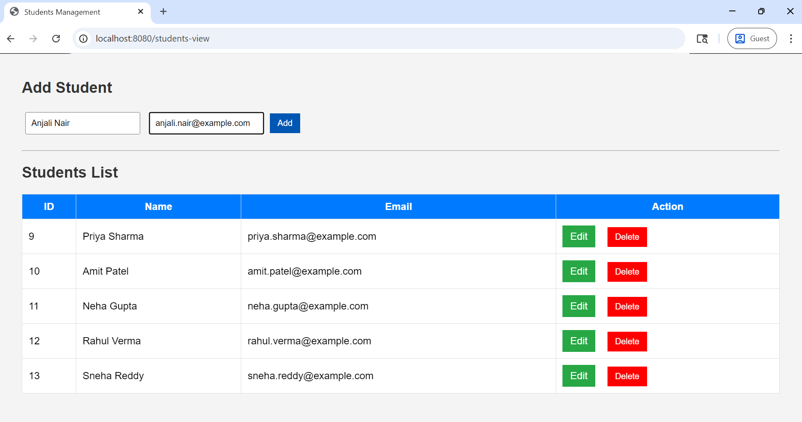
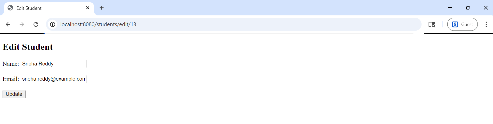

# 📘 Attendance Management System

## Project Overview
This is a full-stack web application built using Spring Boot to manage student attendance.  
Admins can create, update, delete, and view student records through a web interface.

---

## Tech Stack
- Java (Spring Boot)
- Spring MVC Architecture
- MySQL Database
- Thymeleaf (Frontend)
- Spring Data JPA (Hibernate)
- Spring Security (basic setup)

---

## Features
- Add new students
- View all students
- Update student details
- Delete student records
- Web-based UI using Thymeleaf
- RESTful API design

---

## Project Structure
controller → handles requests\
service → business logic\
repository → database operations\
model → data entities\
config → configurations

---

## How to Run the Project

1. Clone the repository: git clone https://github.com/your-username/attendance-management-system.git
2. Open in IntelliJ / Eclipse
3. Configure MySQL in `application.properties`
4. Run the application
5. Open browser: http://localhost:8080/students-view

---

## Screenshots
### Home Page

### Edit Page

---

## Future Improvements
- Add authentication (Admin/User roles)
- Add attendance tracking
- Improve UI with Bootstrap

---

## Author

[Prathamesh Kakde](https://github.com/prathameshkakde)

---

> ## Note
> This project idea is inspired by an [article](https://www.geeksforgeeks.org/blogs/java-projects/#:~:text=3.%20Attendance%20Management%20System) from [GeeksforGeeks](https://www.geeksforgeeks.org/).
---