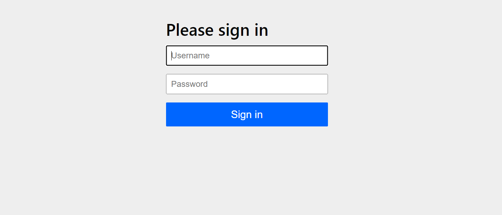
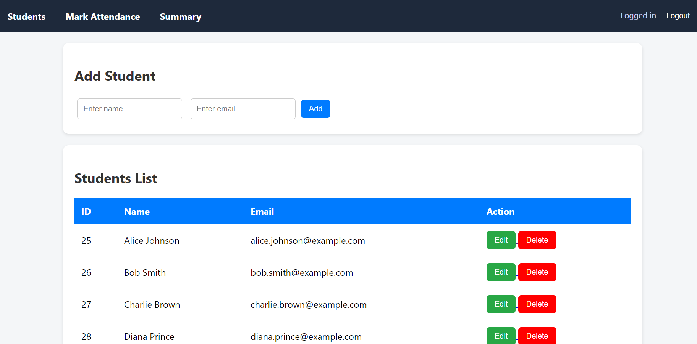
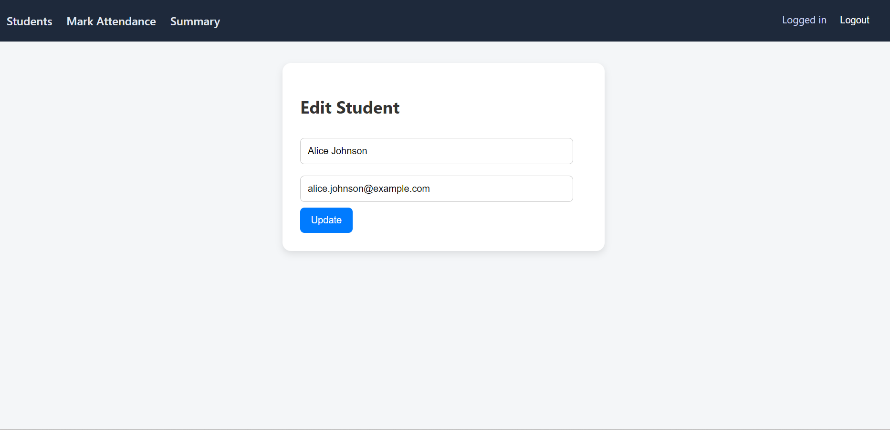
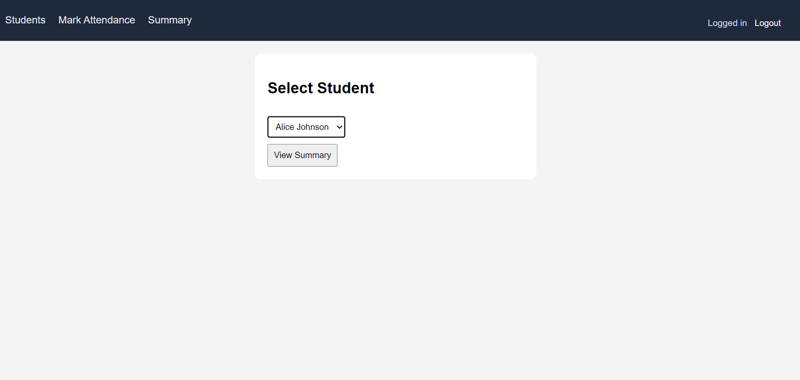
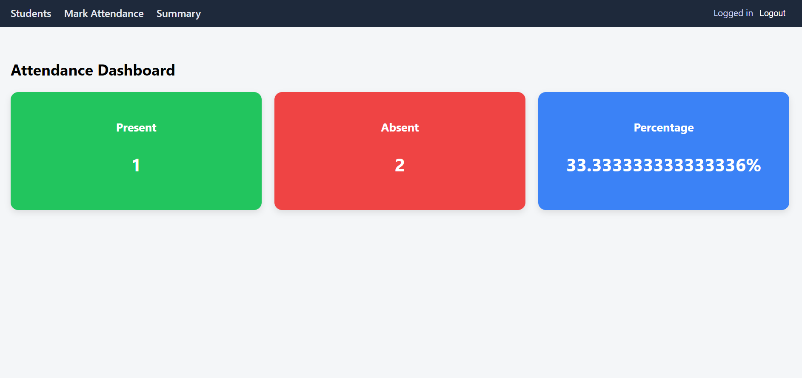
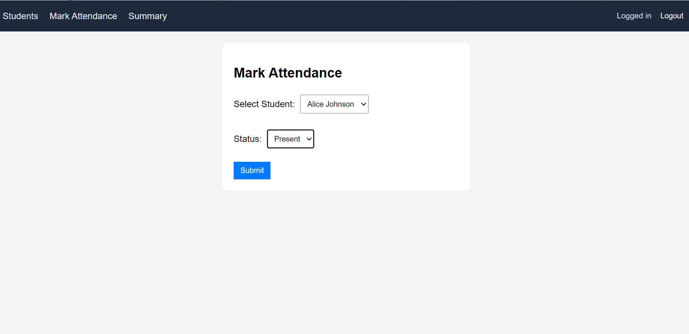
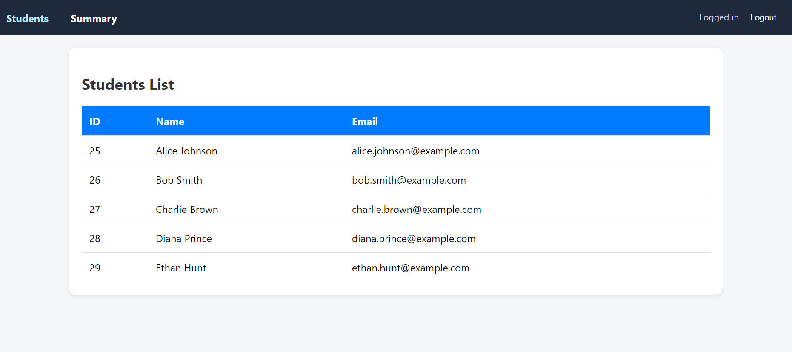
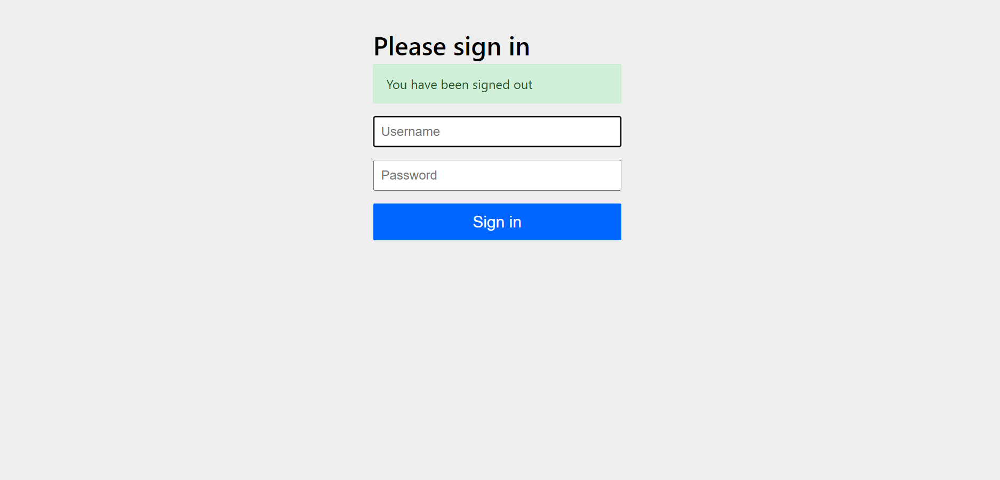

# 📘 Attendance Management System

## Project Overview

This is a full-stack web application built using **Spring Boot** to manage student attendance in an organized and secure way.
The system supports **role-based access control**, allowing admins to manage data while students can view attendance records.

---

## Key Features

### Admin Features

* Add new students
* Update student details
* Delete student records
* Mark attendance (Present/Absent)
* View attendance summary dashboard

### Student Features

* View student list
* View attendance summary
* Restricted from modifying data

### Security Features

* Login system using Spring Security
* Role-Based Access Control (ADMIN / STUDENT)
* Protected endpoints (backend security)
* UI-based restriction (buttons hidden for unauthorized users)
* Custom Access Denied page

### Dashboard

* Attendance summary displayed using:

    * Total Present
    * Total Absent
    * Percentage
* Clean card-based UI

### UI/UX Improvements

* Modern navigation bar (reusable fragment)
* Card-based layouts
* Clean and responsive design
* Consistent styling across all pages

---

## Tech Stack

* **Backend:** Java, Spring Boot
* **Architecture:** Spring MVC
* **Database:** MySQL
* **ORM:** Spring Data JPA (Hibernate)
* **Frontend:** Thymeleaf
* **Security:** Spring Security
* **Build Tool:** Maven

---

## 📂 Project Structure

controller → Handles HTTP requests
service → Business logic
repository → Database operations
model → Entity classes
config → Security & application configuration
templates → Thymeleaf UI pages
fragments → Reusable UI components

---

## ⚙How to Run the Project

### 1️⃣ Clone Repository

```bash
git clone https://github.com/your-username/attendance-management-system.git
cd attendance-management-system
```

---

### 2️⃣ Configure Database

Update `application.properties`:

```properties
spring.datasource.url=jdbc:mysql://localhost:3306/attendance_db
spring.datasource.username=your_username
spring.datasource.password=your_password
spring.jpa.hibernate.ddl-auto=update
```

---

### 3️⃣ Build the Project

```bash
mvn clean package
```

---

### 4️⃣ Run the Application

```bash
java -jar target/attendance-0.0.1-SNAPSHOT.jar
```

---

### 5️⃣ Open in Browser

```
http://localhost:8080/students-view
```

---

## Default Login Credentials

| Role    | Username | Password   |
| ------- | -------- | ---------- |
| Admin   | admin    | admin123   |
| Student | student  | student123 |

---

## Screenshots

### Login



### Admin View



### Edit Student



### Attendance Summary




### Mark Attendance



### Student View



### Logout



---

## 🧪 Demo Data

The project includes sample students and attendance records for testing and demonstration purposes.

---

## 🔮 Future Improvements

* Password encryption using BCrypt
* Export attendance reports (PDF/Excel)
* Pagination & search
* REST API for external integrations
* Deployment on cloud (AWS / Render)

---

## 👨‍💻 Author

**Prathamesh Kakde**
🔗 https://github.com/prathameshkakde

---

## 📌 Note

This project was initially inspired by an article from GeeksforGeeks, but has been significantly enhanced with:

* Role-based security
* Full-stack architecture
* Modern UI/UX improvements

---
